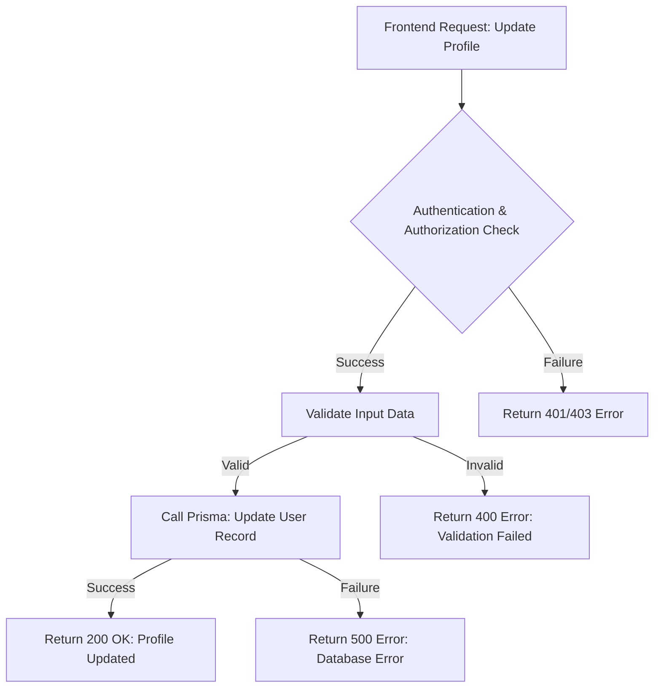
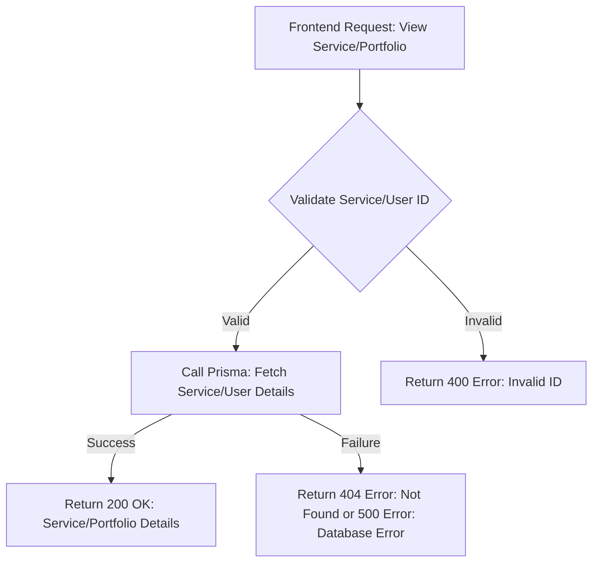
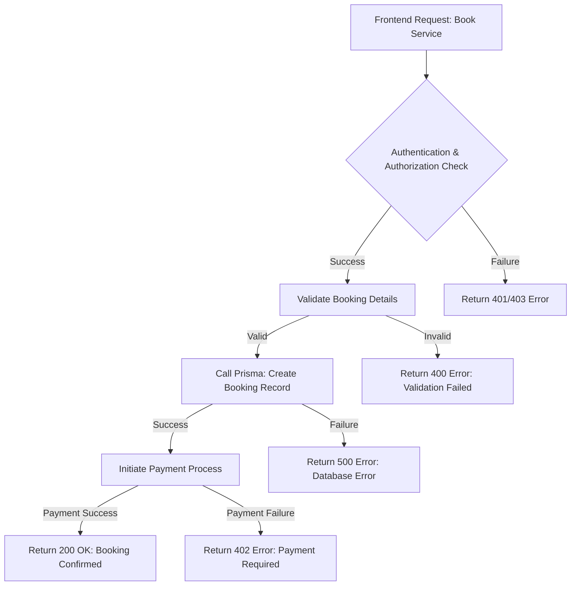
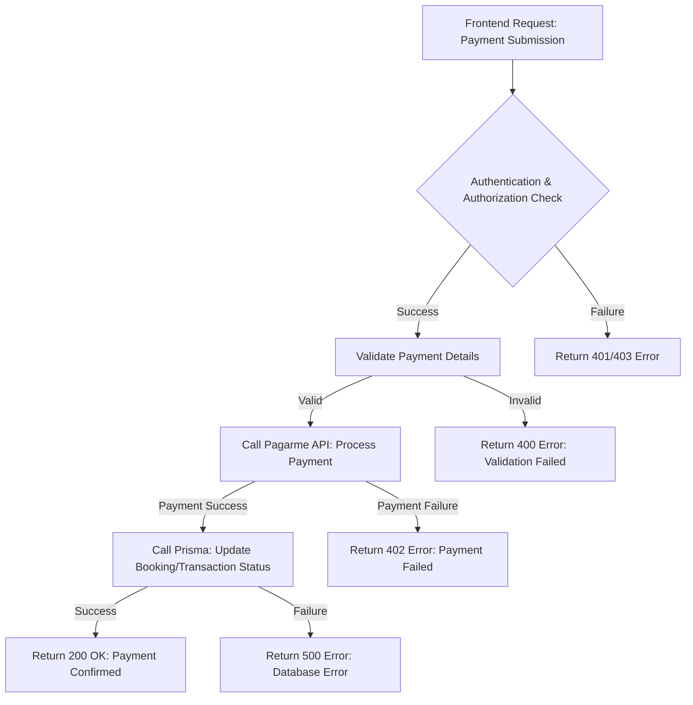
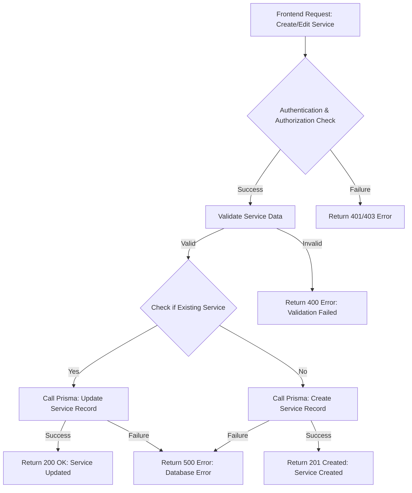
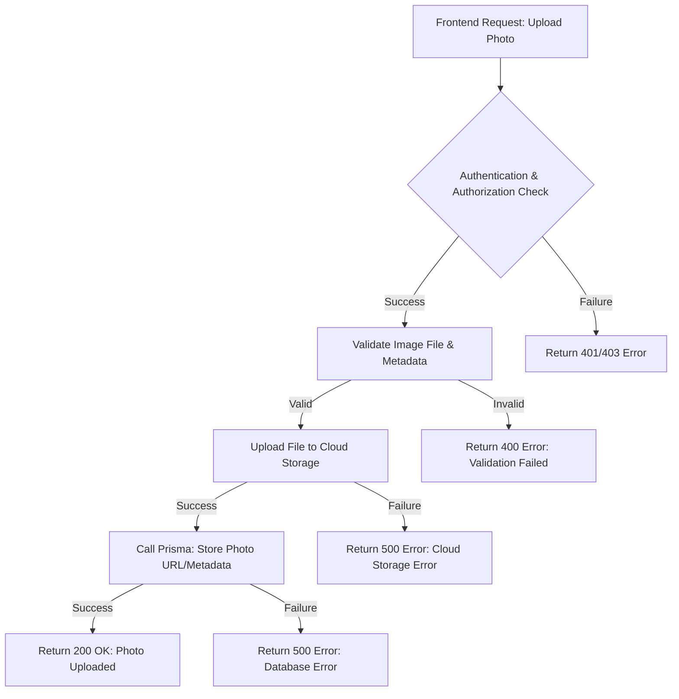
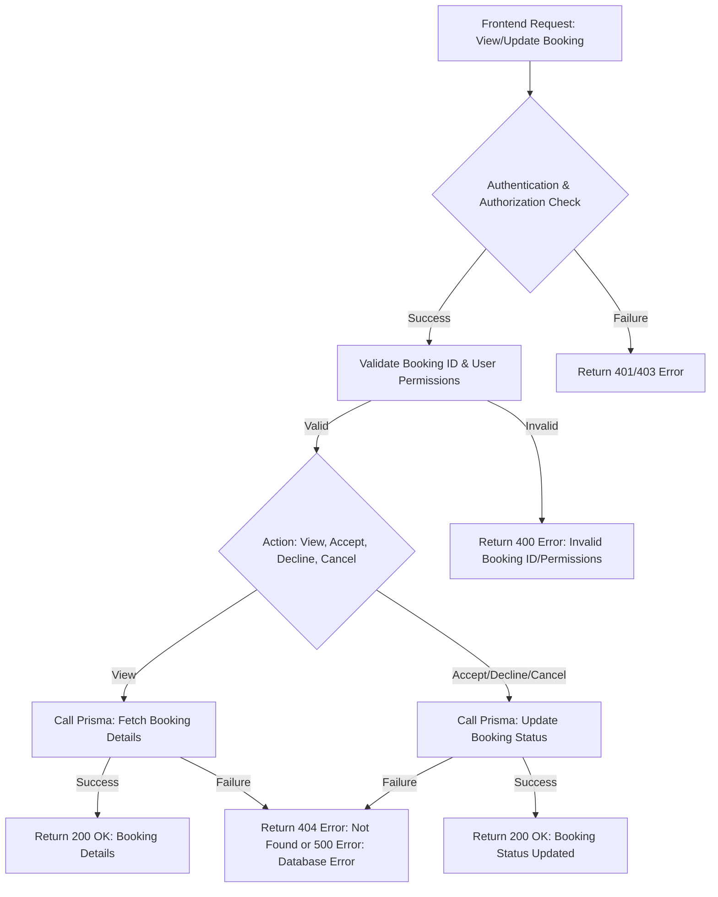
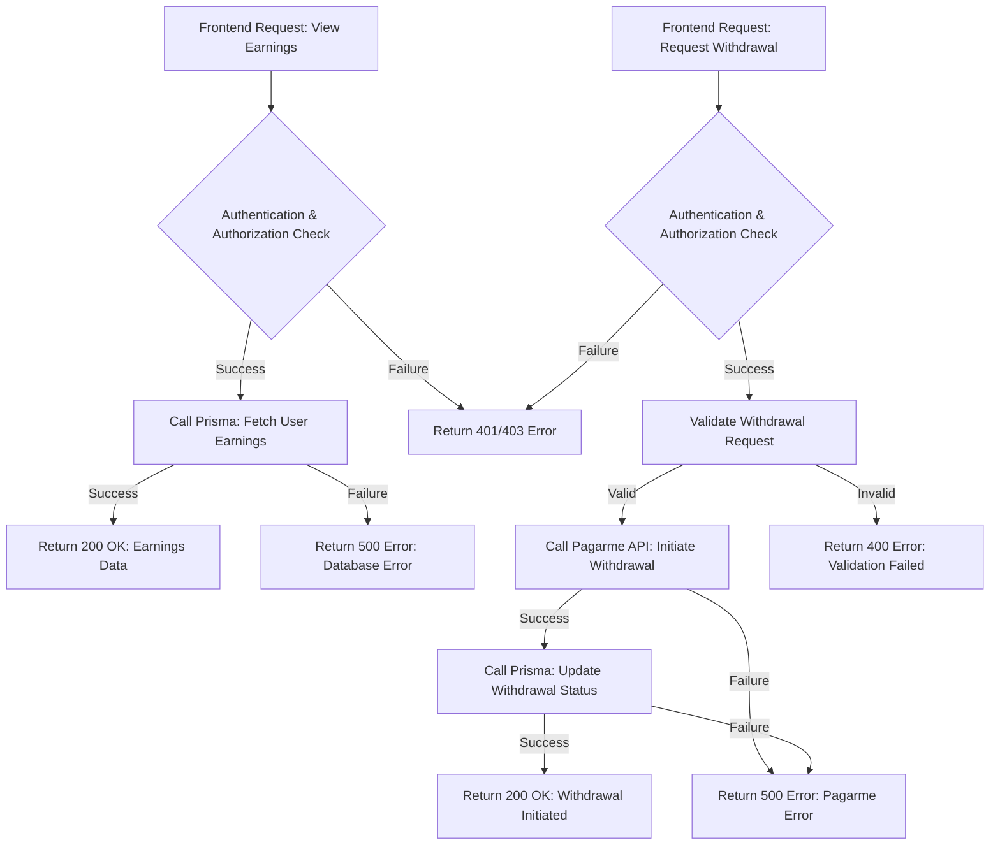
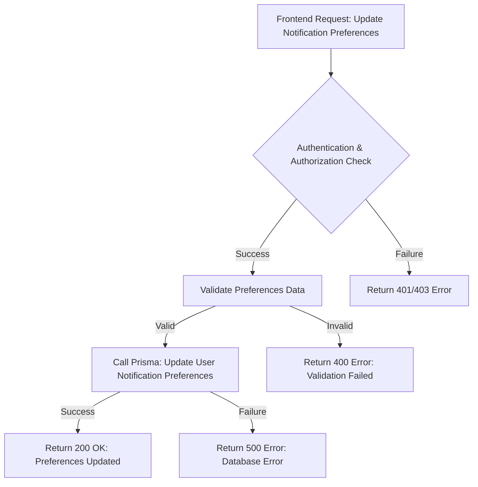

# Backend Service Operations

This document outlines the backend operations for each high-level user use case, using Mermaid flowcharts to visualize the process.

## Manage Profile



## Search for Services

```mermaid
graph TD
    A[Frontend Request: Search Query] --> B{Validate Search Parameters}
    B -- Valid --> C[Call Prisma: Search Services (with pgvector for semantic search)]
    B -- Invalid --> D[Return 400 Error: Invalid Parameters]
    C -- Success --> E[Return 200 OK: Search Results]
    C -- Failure --> F[Return 500 Error: Database/Search Error]
```

## View Service/Portfolio



## Book a Service



## Pay for Service



## Leave a Review

```mermaid
graph TD
    A[Frontend Request: Submit Review] --> B{Authentication & Authorization Check}
    B -- Success --> C[Validate Review Data]
    B -- Failure --> D[Return 401/403 Error]
    C -- Valid --> E[Call Prisma: Create Review Record]
    C -- Invalid --> F[Return 400 Error: Validation Failed]
    E -- Success --> G[Call Prisma: Update Service/Professional Rating (Optional)]
    E -- Failure --> H[Return 500 Error: Database Error]
    G -- Success --> I[Return 200 OK: Review Submitted]
    G -- Failure --> H
```

## Create/Edit Service Listing



## Upload Photos



## Manage Bookings



## View Earnings & Request Withdrawal



## Manage Notification Preferences


