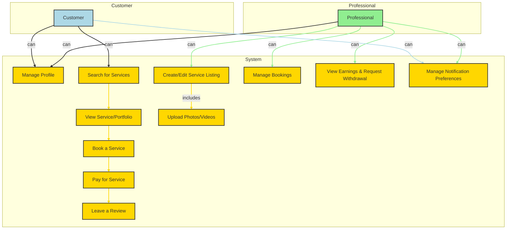
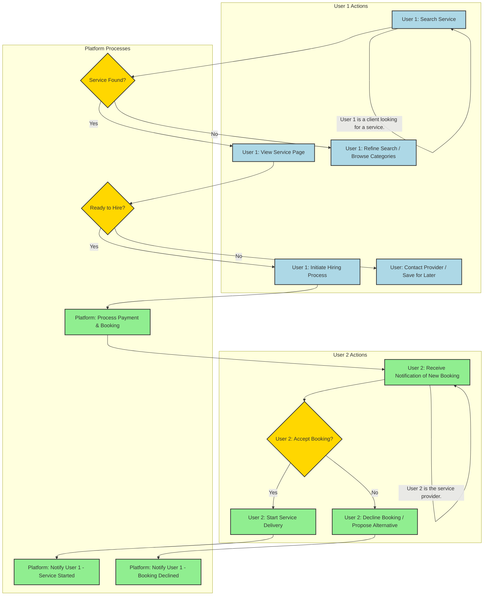

# Authentication: The Key to the Kingdom

Authentication is the gateway to our platform. We've designed it to be as seamless and secure as possible.

## The Philosophy: Simplicity and Security

We believe that users shouldn't have to remember yet another password. That's why we've chosen to integrate with Google, a trusted identity provider that billions of people use every day. This approach offers several advantages:

*   **Effortless Onboarding:** New users can join with a single click, without filling out lengthy registration forms.
*   **Enhanced Security:** We leverage Google's robust security measures, including two-factor authentication, to protect our users' accounts.
*   **No Password Liability:** By not storing passwords, we eliminate a major security risk.

## The Technology: NextAuth.js

We use NextAuth.js, a flexible and powerful authentication library for Next.js. It handles the complexities of OAuth 2.0, session management, and token issuance, allowing us to focus on building a great user experience.

### The Flow

1.  **The Spark:** A user clicks the "Sign in with Google" button.
2.  **The Handshake:** Our frontend redirects the user to Google's authentication page.
3.  **The Consent:** The user grants our application permission to access their basic profile information.
4.  **The Callback:** Google redirects the user back to our application with an authorization code.
5.  **The Verification:** Our backend exchanges the authorization code for an access token and a refresh token.
6.  **The Session:** NextAuth.js creates a secure, HTTP-only cookie containing a JSON Web Token (JWT). This token is our key to identifying the user in subsequent requests.
7.  **The Welcome:** The user is now authenticated and can access all the features of the platform.

## Diagram
```mermaid
sequenceDiagram
    participant User
    participant Frontend
    participant Backend
    participant NextAuth
    participant Google

    User->>Frontend: Clicks "Sign in with Google"
    Frontend->>Backend: Initiates OAuth flow
    Backend->>Google: Redirects user to Google
    Google->>User: Presents consent screen
    User->>Google: Grants permission
    Google-->>Backend: Returns access and refresh tokens
    Backend->>NextAuth: Creates session
    NextAuth-->>Frontend: Sets session cookie
    Frontend-->>User: User is logged in

    style User fill:#ADD8E6,stroke:#333,stroke-width:2px
    style Frontend fill:#90EE90,stroke:#333,stroke-width:2px
    style Backend fill:#FFD700,stroke:#333,stroke-width:2px
    style NextAuth fill:#FFB6C1,stroke:#333,stroke-width:2px
    style Google fill:#DDA0DD,stroke:#333,stroke-width:2px
```

# Notifications: Keeping Users Informed

Timely and relevant notifications are crucial for a positive user experience. Our notification system is designed to keep users in the loop about the events that matter most to them, using the channels they prefer.

## The Power of Twilio

We use Twilio as our communications backbone. Twilio is a robust and scalable platform that allows us to reliably send notifications across multiple channels:

*   **SMS:** For urgent, time-sensitive alerts.
*   **WhatsApp:** For rich, interactive conversations and notifications.
*   **Email:** For more detailed, non-urgent information and summaries.

## Key Notification Events

The system will automatically send notifications for the following key events:

*   **New Booking:** A professional receives an alert when a client books their service.
*   **Booking Confirmation:** A client receives a confirmation once their payment is successful.
*   **Service Completed:** A notification is sent when a service is marked as complete, prompting the client to leave a review.
*   **Withdrawal Successful:** A professional is notified when their withdrawal has been processed.

## Diagram: Notification Flow

```mermaid
sequenceDiagram
    participant Backend
    participant Twilio
    participant User

    Backend->>Backend: An event occurs (e.g., new booking)
    Backend->>Twilio: API call with notification details (channel, recipient, message)
    Twilio->>User: Delivers message via SMS, WhatsApp, or Email
    Twilio-->>Backend: Returns delivery status

    style Backend fill:#FFD700,stroke:#333,stroke-width:2px
    style Twilio fill:#87CEEB,stroke:#333,stroke-width:2px
    style User fill:#ADD8E6,stroke:#333,stroke-width:2px
```

# Payments: The Engine of Commerce

Our payment system is designed to be secure, transparent, and fair to both clients and professionals.

## The Foundation: Pagarme

We've partnered with Pagarme, a leading payment gateway in Brazil, to handle all of our payment processing. This allows us to offer a wide range of payment methods, including credit cards, Pix, and boleto, while ensuring the highest level of security.

## The Escrow Model: A Circle of Trust

We use an escrow model to protect both parties in a transaction:

1.  **The Commitment:** When a client books a service, they pay the full amount to our platform. This shows that they are serious about the service and have the funds to pay for it.
2.  **The Safety Net:** The funds are held in our Pagarme account until the service is completed. This gives the professional the confidence to start working, knowing that they will be paid.
3.  **The Reward:** Once either the client or the professional notifies the platform that the service is complete, the funds are released to the professional's platform account, minus our service fee. These funds become available for withdrawal after a 15-day holding period to allow for dispute resolution.

## The Withdrawal Process: Your Money, Your Way

We want to make it as easy as possible for our users to access their earnings.

1.  **The Request:** A user can request a withdrawal from their platform account at any time.
2.  **The Transfer:** We process the request and transfer the funds to the user's registered bank account via the Pagarme API.
3.  **The Confirmation:** The user receives a notification that the transfer is complete.

## Diagrams

### Booking Flow
```mermaid
        sequenceDiagram
            participant "User (as Client)"
            participant "User (as Professional)"
            participant Frontend
            participant Backend
            participant Pagarme
            participant Twilio

            "User (as Client)"->>Frontend: Selects a service to book
            Frontend->>Backend: POST /api/bookings (serviceId)
            Backend->>Pagarme: Create Charge
            Pagarme-->>Backend: Returns payment details
            Backend-->>Frontend: Displays payment instructions
            "User (as Client)"->>Pagarme: Completes payment
            Pagarme->>Backend: Webhook notification (payment success)
            Backend->>Backend: Update booking status to "Paid", credit professional's account balance
            Backend->>Twilio: Send booking confirmation to Client
            Backend->>Twilio: Send new booking alert to Professional
            Backend->>Frontend: Notify client of success
            "User (as Professional)"->>Backend: Notifies service complete
            "User (as Client)"->>Backend: (Optional) Notifies service complete
            Backend->>Backend: Funds held for 15 days
            Backend->>"User (as Professional)": Funds available for withdrawal after 15 days

            style "User (as Client)" fill:#ADD8E6,stroke:#333,stroke-width:2px
            style "User (as Professional)" fill:#90EE90,stroke:#333,stroke-width:2px
            style Frontend fill:#FFB6C1,stroke:#333,stroke-width:2px
            style Backend fill:#FFD700,stroke:#333,stroke-width:2px
            style Pagarme fill:#DDA0DD,stroke:#333,stroke-width:2px
            style Twilio fill:#87CEEB,stroke:#333,stroke-width:2px
```

### Withdrawal Flow
```mermaid
        sequenceDiagram
            participant "User (as Professional)"
            participant Frontend
            participant Backend
            participant Pagarme
            participant Twilio

            "User (as Professional)"->>Frontend: Requests withdrawal
            Frontend->>Backend: POST /api/withdrawals (amount)
            Backend->>Backend: Verify user balance and process request
            Backend->>Pagarme: Initiate Transfer to user's bank account
            Pagarme-->>Backend: Confirmation of transfer
            Backend->>Backend: Update user's balance
            Backend->>Twilio: Send withdrawal confirmation to Professional
            Backend-->>Frontend: Notify user of successful withdrawal

            style "User (as Professional)" fill:#90EE90,stroke:#333,stroke-width:2px
            style Frontend fill:#FFB6C1,stroke:#333,stroke-width:2px
            style Backend fill:#FFD700,stroke:#333,stroke-width:2px
            style Pagarme fill:#DDA0DD,stroke:#333,stroke-width:2px
            style Twilio fill:#87CEEB,stroke:#333,stroke-width:2px
```

# Search: The Art of Discovery

Search is not just a feature; it's the core of the user experience. Our goal is to make finding the right service as intuitive and effortless as possible.

## The Problem with Keywords

Traditional search engines rely on keywords. If a user searches for "website design," they will only find services that contain those exact words. This is a very limited approach. What if the user searches for "online store" or "e-commerce site"? A keyword-based search would miss these relevant results.

## The Solution: Semantic Search

We use a technique called semantic search, which is powered by machine learning and vector embeddings. Here's how it works:

1.  **The Essence of Meaning:** When a user creates a service, we use a machine learning model to generate a vector embedding from the service description. This embedding is a list of numbers that represents the semantic meaning of the text.
2.  **The User's Intent:** When a user types a search query, we generate an embedding for their query as well.
3.  **The Perfect Match:** We then compare the user's query embedding to the embeddings of all the services in our database. The services with the most similar embeddings are the most relevant results.

## The Technology: pgvector

We use `pgvector`, a PostgreSQL extension that allows us to store and query vector embeddings directly in our database. This is a powerful and efficient way to implement semantic search.

## The Result: A More Human-Centered Search

With semantic search, our users can find what they're looking for, even if they don't know the exact keywords to use. It's a more human-centered approach to search that leads to better results and a more satisfying user experience.

## Diagram

```mermaid
        sequenceDiagram
            participant User
            participant Frontend
            participant Backend
            participant EmbeddingModel
            participant Database

            User->>Frontend: Enters search query (e.g., "logo design for my new coffee shop")
            Frontend->>Backend: Sends search query
            Backend->>EmbeddingModel: Generates embedding for the query
            EmbeddingModel-->>Backend: Returns query embedding
            Backend->>Database: Performs vector similarity search for services
            Database-->>Backend: Returns ranked list of matching services
            Backend-->>Frontend: Sends service results
            Frontend-->>User: Displays relevant services

            style User fill:#ADD8E6,stroke:#333,stroke-width:2px
            style Frontend fill:#90EE90,stroke:#333,stroke-width:2px
            style Backend fill:#FFD700,stroke:#333,stroke-width:2px
            style EmbeddingModel fill:#FFB6C1,stroke:#333,stroke-width:2px
            style Database fill:#DDA0DD,stroke:#333,stroke-width:2px
```

# Services Page

The services page provides an overview of the offerings available to clients. It features a concise description of the services, followed by a gallery of photos.

Users can browse through the photos horizontally to get a visual understanding of the services. Each service listed on this page is available for hire through a dedicated "Hire Now" button.

## Features:

*   Simple and clear description of services.
*   Photo gallery with horizontal scrolling.
*   "Hire Now" button for direct engagement.

# User Journeys on the Platform

This document outlines the key user journeys and interactions within the platform, detailing the steps users take to achieve their goals and how different user roles interact. Diagrams are rendered using Mermaid.

## High-Level User Use Cases


## Example Journey: Service Discovery & Hiring


# Frontend Screens and Navigation Flow

This document outlines the key frontend screens of the application and illustrates the navigation flow between them, distinguishing between customer and professional user experiences.

## 1. Customer Screens
<ul>
    <li><strong>Home Screen:</strong> Landing page with featured services, search bar, and categories.</li>
    <li><strong>Search Results Screen:</strong> Displays services based on search queries or category selection.</li>
    <li><strong>Service Detail Screen:</strong> Detailed view of a specific service, including description, pricing, photos, and professional's profile link.</li>
    <li><strong>Professional Profile Screen:</strong> Displays the professional's public profile, including all their services and reviews.</li>
    <li><strong>Booking Confirmation Screen:</strong> Summary of a booked service before payment.</li>
    <li><strong>Payment Screen:</strong> Interface for completing the payment for a booked service.</li>
    <li><strong>My Bookings Screen (Customer):</strong> Lists all services booked by the customer.</li>
    <li><strong>Reviews Screen:</strong> Allows customers to leave reviews for completed services.</li>
</ul>

<h2>2. Professional Screens</h2>
<ul>
    <li><strong>Professional Dashboard:</strong> Overview for professionals, showing active services, pending bookings, and earnings.</li>
    <li><strong>My Services Screen:</strong> Lists all services created by the professional, with options to edit or deactivate.</li>
    <li><strong>Create Service Screen:</strong> Form for professionals to create new service listings.</li>
    <li><strong>Edit Service Screen:</strong> Form for professionals to modify existing service listings.</li>
    <li><strong>My Bookings Screen (Professional):</strong> Lists all bookings received by the professional.</li>
    <li><strong>Earnings & Withdrawal Screen:</strong> Displays earnings, available balance, and allows withdrawal requests.</li>
    <li><strong>Professional Profile Screen (Edit):</strong> Allows professionals to edit their public profile information.</li>
</ul>

<h2>3. Navigation Flow Diagram</h2>
<pre class="mermaid">
    graph TD
        subgraph Customer Flow
            C_HOME[Home Screen] --> C_SEARCH[Search Results Screen]
            C_SEARCH --> C_SERVICE_DETAIL[Service Detail Screen]
            C_SERVICE_DETAIL --> C_PROF_PROFILE[Professional Profile Screen]
            C_SERVICE_DETAIL --> C_BOOKING_CONFIRM[Booking Confirmation Screen]
            C_BOOKING_CONFIRM --> C_PAYMENT[Payment Screen]
            C_PAYMENT --> C_MY_BOOKINGS[My Bookings (Customer)]
            C_MY_BOOKINGS --> C_REVIEWS[Reviews Screen]
            C_HOME --> C_MY_BOOKINGS
        end

        subgraph Professional Flow
            P_DASH[Professional Dashboard] --> P_MY_SERVICES[My Services Screen]
            P_MY_SERVICES --> P_CREATE_SERVICE[Create Service Screen]
            P_MY_SERVICES --> P_EDIT_SERVICE[Edit Service Screen]
            P_DASH --> P_MY_BOOKINGS[My Bookings (Professional)]
            P_DASH --> P_EARNINGS[Earnings & Withdrawal Screen]
            P_DASH --> P_PROF_PROFILE_EDIT[Professional Profile (Edit)]
        end

        %% Cross-role interactions
        C_SERVICE_DETAIL -- View Professional's Services --> P_PROF_PROFILE_EDIT
        P_MY_BOOKINGS -- Service Completed --> C_REVIEWS
        C_PAYMENT -- Payment Success --> P_MY_BOOKINGS
</pre>

# Backend Service Operations

This section details the backend operations for each high-level user use case, visualized with Mermaid flowcharts. The diagrams use a color-coding scheme to represent different layers and states:

*   **Frontend Request**: <span style="color:#ADD8E6;">Light Blue</span>
*   **Authentication & Authorization**: <span style="color:#FFD700;">Gold</span>
*   **Validation (Zod)**: <span style="color:#90EE90;">Light Green</span>
*   **Prisma (ORM) Operations**: <span style="color:#DDA0DD;">Plum</span>
*   **External API Calls**: <span style="color:#87CEEB;">Sky Blue</span>
*   **Success State**: <span style="color:#C8E6C9;">Mint Green</span>
*   **Error State**: <span style="color:#FFCDD2;">Light Red</span>


*   [Manage Profile](./backend-services/manage-profile.html)
*   [Search for Services](./backend-services/search-for-services.html)
*   [View Service/Portfolio](./backend-services/view-service-portfolio.html)
*   [Book a Service](./backend-services/book-a-service.html)
*   [Pay for Service](./backend-services/pay-for-service.html)
*   [Leave a Review](./backend-services/leave-a-review.html)
*   [Create/Edit Service Listing](./backend-services/create-edit-service-listing.html)
*   [Upload Photos](./backend-services/upload-photos.html)
*   [Manage Bookings](./backend-services/manage-bookings.html)
*   [View Earnings & Request Withdrawal](./backend-services/view-earnings-request-withdrawal.html)
*   [Manage Notification Preferences](./backend-services/manage-notification-preferences.html)
