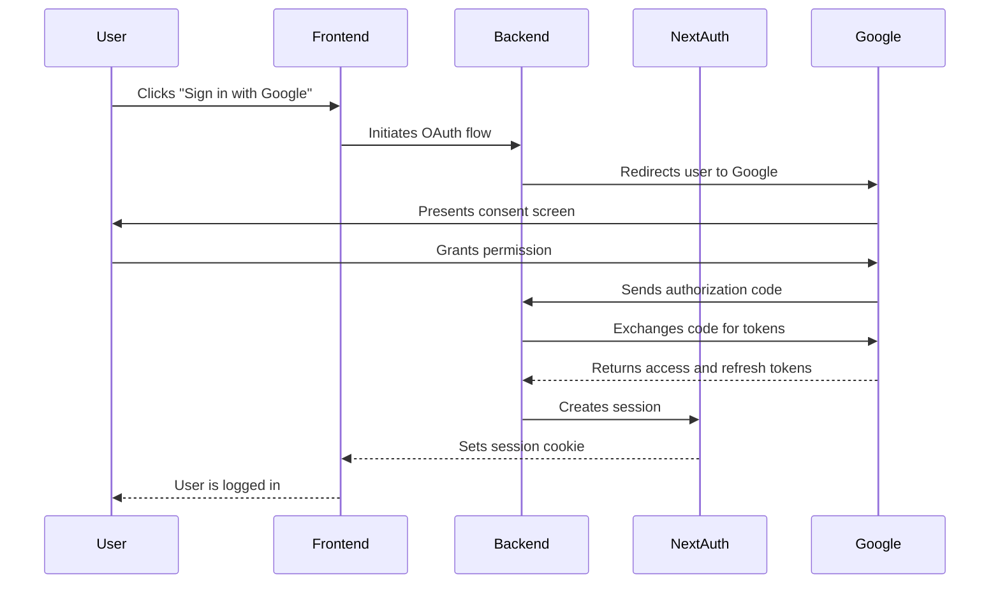
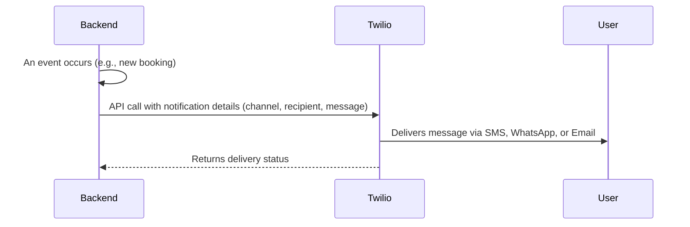
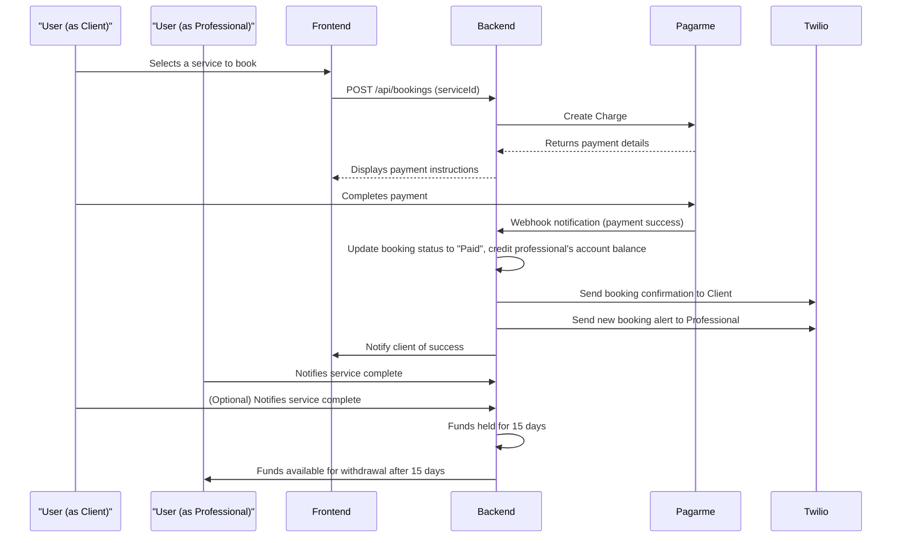
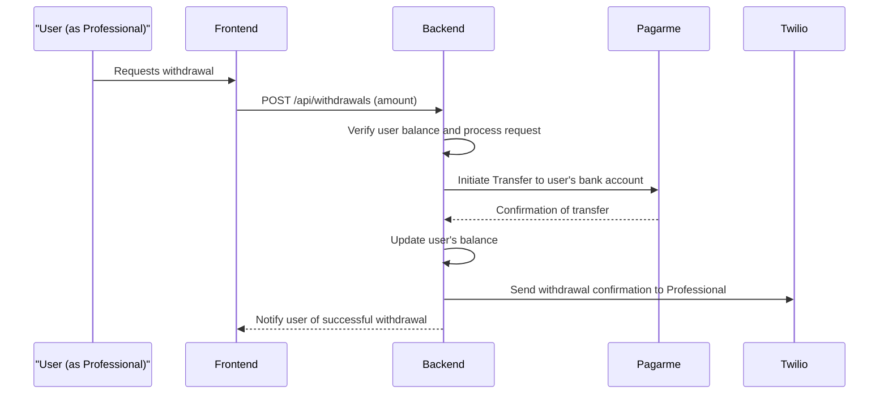
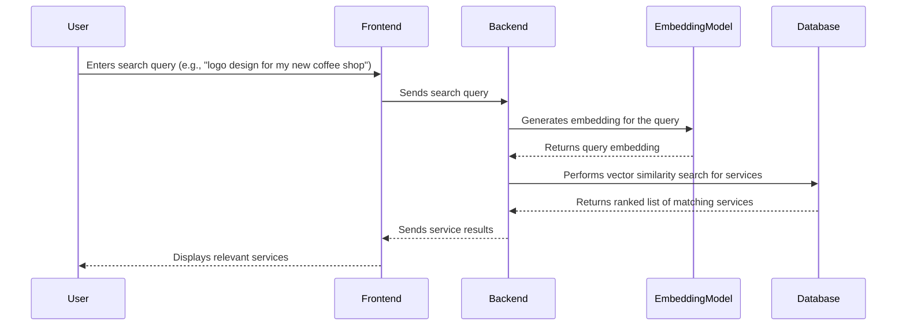
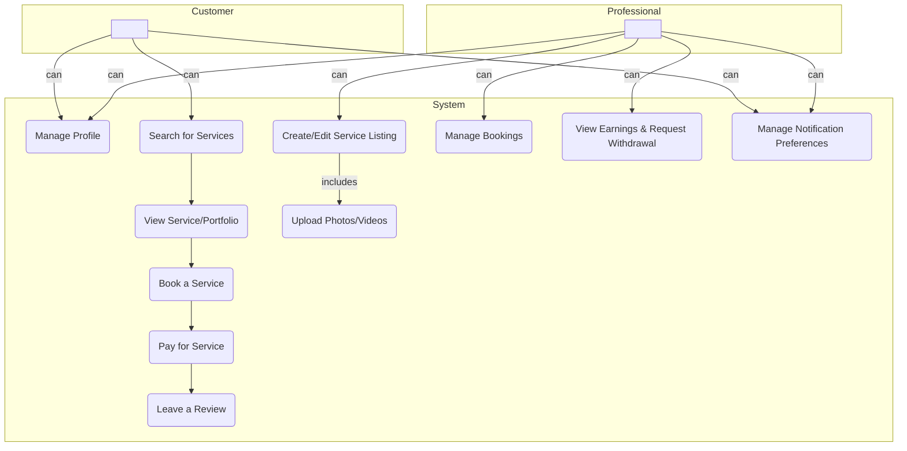
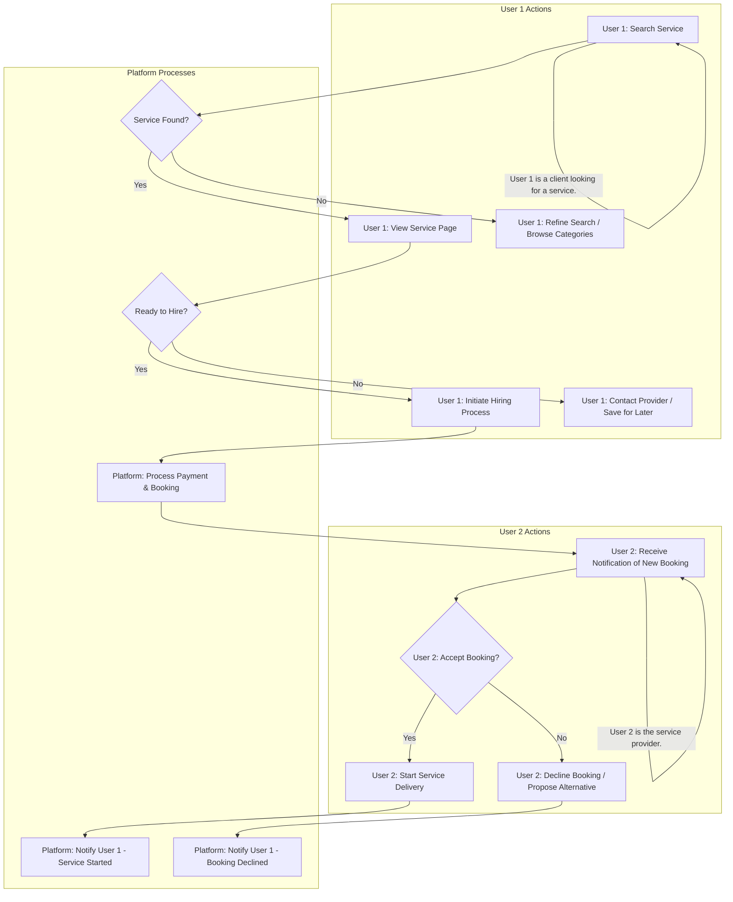

# Authentication: The Key to the Kingdom

Authentication is the gateway to our platform. We've designed it to be as seamless and secure as possible.

## The Philosophy: Simplicity and Security

We believe that users shouldn't have to remember yet another password. That's why we've chosen to integrate with Google, a trusted identity provider that billions of people use every day. This approach offers several advantages:

*   **Effortless Onboarding:** New users can join with a single click, without filling out lengthy registration forms.
*   **Enhanced Security:** We leverage Google's robust security measures, including two-factor authentication, to protect our users' accounts.
*   **No Password Liability:** By not storing passwords, we eliminate a major security risk.

## The Technology: NextAuth.js

We use NextAuth.js, a flexible and powerful authentication library for Next.js. It handles the complexities of OAuth 2.0, session management, and token issuance, allowing us to focus on building a great user experience.

### The Flow

1.  **The Spark:** A user clicks the "Sign in with Google" button.
2.  **The Handshake:** Our frontend redirects the user to Google's authentication page.
3.  **The Consent:** The user grants our application permission to access their basic profile information.
4.  **The Callback:** Google redirects the user back to our application with an authorization code.
5.  **The Verification:** Our backend exchanges the authorization code for an access token and a refresh token.
6.  **The Session:** NextAuth.js creates a secure, HTTP-only cookie containing a JSON Web Token (JWT). This token is our key to identifying the user in subsequent requests.
7.  **The Welcome:** The user is now authenticated and can access all the features of the platform.

## Diagram

# Notifications: Keeping Users Informed

Timely and relevant notifications are crucial for a positive user experience. Our notification system is designed to keep users in the loop about the events that matter most to them, using the channels they prefer.

## The Power of Twilio

We use Twilio as our communications backbone. Twilio is a robust and scalable platform that allows us to reliably send notifications across multiple channels:

*   **SMS:** For urgent, time-sensitive alerts.
*   **WhatsApp:** For rich, interactive conversations and notifications.
*   **Email:** For more detailed, non-urgent information and summaries.

## Key Notification Events

The system will automatically send notifications for the following key events:

*   **New Booking:** A professional receives an alert when a client books their service.
*   **Booking Confirmation:** A client receives a confirmation once their payment is successful.
*   **Service Completed:** A notification is sent when a service is marked as complete, prompting the client to leave a review.
*   **Withdrawal Successful:** A professional is notified when their withdrawal has been processed.

## Diagram: Notification Flow

# Payments: The Engine of Commerce

Our payment system is designed to be secure, transparent, and fair to both clients and professionals.

## The Foundation: Pagarme

We've partnered with Pagarme, a leading payment gateway in Brazil, to handle all of our payment processing. This allows us to offer a wide range of payment methods, including credit cards, Pix, and boleto, while ensuring the highest level of security.

## The Escrow Model: A Circle of Trust

We use an escrow model to protect both parties in a transaction:

1.  **The Commitment:** When a client books a service, they pay the full amount to our platform. This shows that they are serious about the service and have the funds to pay for it.
2.  **The Safety Net:** The funds are held in our Pagarme account until the service is completed. This gives the professional the confidence to start working, knowing that they will be paid.
3.  **The Reward:** Once either the client or the professional notifies the platform that the service is complete, the funds are released to the professional's platform account, minus our service fee. These funds become available for withdrawal after a 15-day holding period to allow for dispute resolution.

## The Withdrawal Process: Your Money, Your Way

We want to make it as easy as possible for our users to access their earnings.

1.  **The Request:** A user can request a withdrawal from their platform account at any time.
2.  **The Transfer:** We process the request and transfer the funds to the user's registered bank account via the Pagarme API.
3.  **The Confirmation:** The user receives a notification that the transfer is complete.

## Diagrams

### Booking Flow

### Withdrawal Flow

# Search: The Art of Discovery

Search is not just a feature; it's the core of the user experience. Our goal is to make finding the right service as intuitive and effortless as possible.

## The Problem with Keywords

Traditional search engines rely on keywords. If a user searches for "website design," they will only find services that contain those exact words. This is a very limited approach. What if the user searches for "online store" or "e-commerce site"? A keyword-based search would miss these relevant results.

## The Solution: Semantic Search

We use a technique called semantic search, which is powered by machine learning and vector embeddings. Here's how it works:

1.  **The Essence of Meaning:** When a user creates a service, we use a machine learning model to generate a vector embedding from the service description. This embedding is a list of numbers that represents the semantic meaning of the text.
2.  **The User's Intent:** When a user types a search query, we generate an embedding for their query as well.
3.  **The Perfect Match:** We then compare the user's query embedding to the embeddings of all the services in our database. The services with the most similar embeddings are the most relevant results.

## The Technology: pgvector

We use `pgvector`, a PostgreSQL extension that allows us to store and query vector embeddings directly in our database. This is a powerful and efficient way to implement semantic search.

## The Result: A More Human-Centered Search

With semantic search, our users can find what they're looking for, even if they don't know the exact keywords to use. It's a more human-centered approach to search that leads to better results and a more satisfying user experience.

## Diagram

# Services Page

The services page provides an overview of the offerings available to clients. It features a concise description of the services, followed by a gallery of photos.

Users can browse through the photos horizontally to get a visual understanding of the services. Each service listed on this page is available for hire through a dedicated "Hire Now" button.

## Features:

*   Simple and clear description of services.
*   Photo gallery with horizontal scrolling.
*   "Hire Now" button for direct engagement.

# User Journeys on the Platform

This document outlines the key user journeys and interactions within the platform, detailing the steps users take to achieve their goals and how different user roles interact. Diagrams are rendered using Mermaid.

## High-Level User Use Cases

## Example Journey: Service Discovery & Hiring
